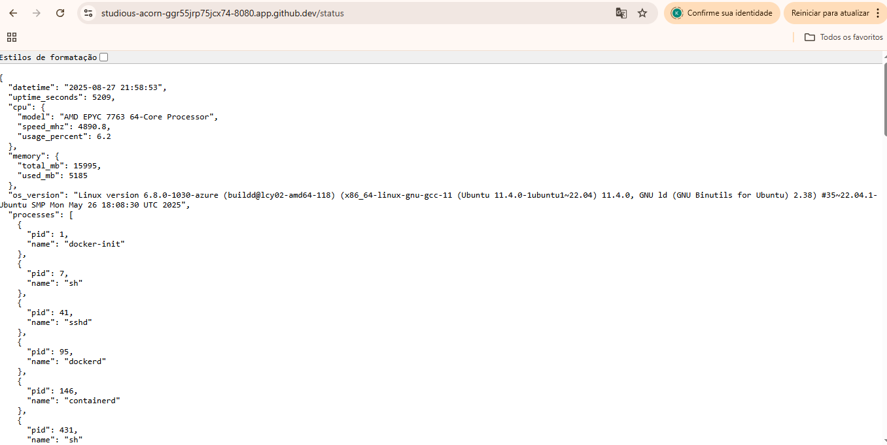
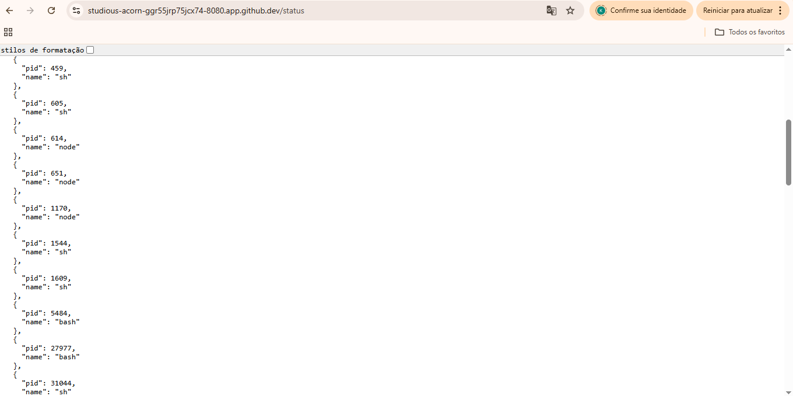
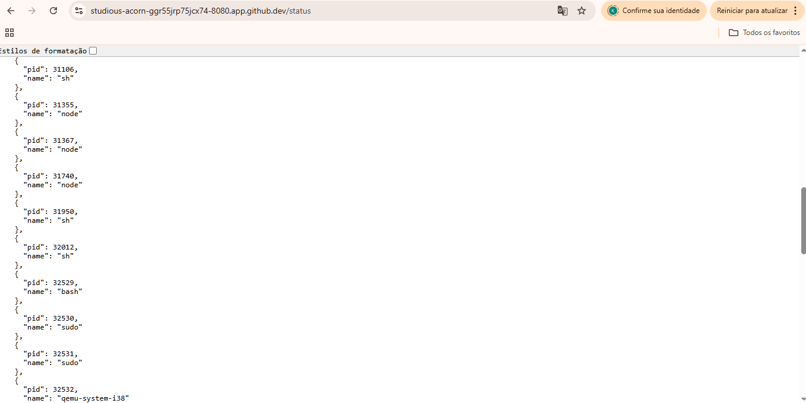
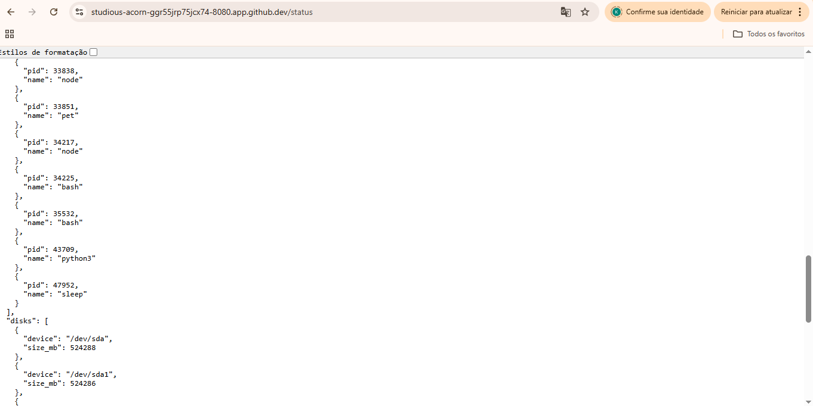
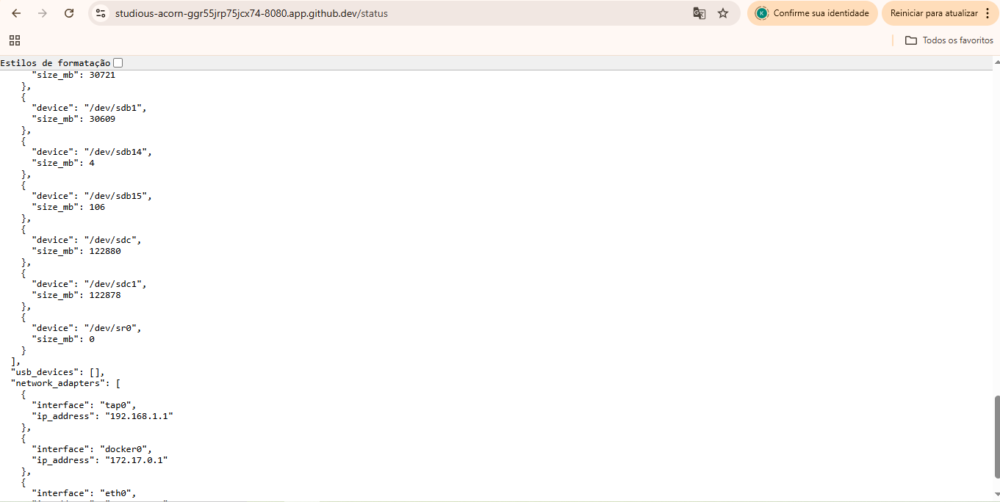
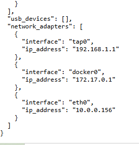
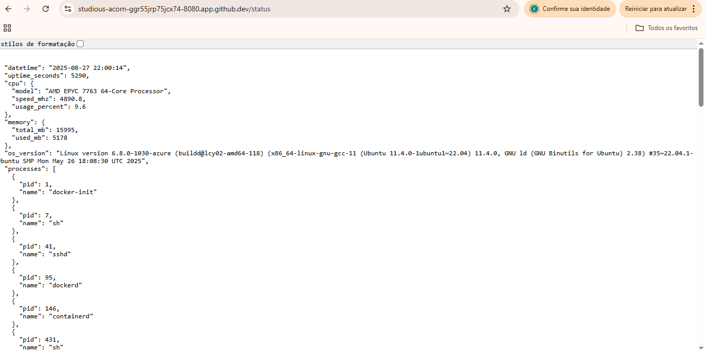
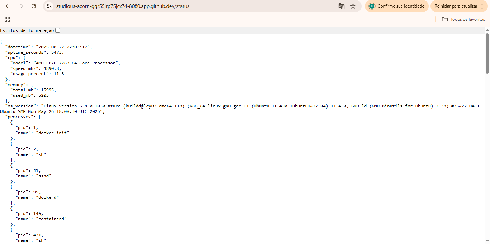

##Descrição do funcionamento básico do programa:
SystemInfo – Servidor HTTP (porta 8080) para exportar informações do sistema
1) Visão geral

Este trabalho constrói, com Buildroot, uma imagem Linux minimalista que, ao inicializar, sobe automaticamente um pequeno servidor HTTP escrito em Python (apenas Standard Library).
Esse servidor expõe um endpoint REST GET /status, que retorna, em JSON, várias informações do sistema (CPU, memória, versão do OS, processos, discos, USB e rede).
Todos os dados são coletados dinamicamente em cada requisição e exclusivamente a partir de /proc e /sys, atendendo aos requisitos do enunciado.

2) Arquitetura e componentes

Buildroot

É usado para gerar o rootfs, o kernel e todo o toolchain.

O arquivo .config na raiz do projeto registra as opções de build (ativação do Python no alvo, BusyBox, drivers etc.) e garante reprodutibilidade.

Aplicação Python – systeminfo.py

Servidor HTTP implementado com http.server (biblioteca padrão).

Implementa o endpoint GET /status.

Ao receber uma requisição, lê arquivos de /proc e /sys, monta um dicionário Python com os campos solicitados e devolve JSON (Content-Type: application/json).

Sem dependências externas (somente Python Standard Library).

Scripts de integração no boot

S50systeminfo (em /etc/init.d): script de inicialização no estilo SysV.

Comando start: executa systeminfo.py em background (via nohup), grava o PID em /var/run/systeminfo.pid e deixa o serviço rodando.

Comandos stop/restart: encerram/recuperam o serviço pelo PID.

pre-build.sh: script que roda no momento certo do Buildroot para copiar systeminfo.py para /usr/bin/ no alvo e instalar o script S50systeminfo em /etc/init.d/ com permissão de execução.

(Opcional para o laboratório) S41network-config: configura IP do guest e rota default durante o boot, quando solicitado pelo roteiro.

3) Linha do tempo de boot (o que acontece quando a imagem sobe)

O kernel inicializa e o init (BusyBox) executa os scripts de /etc/init.d/ em ordem.

S41network-config (se presente) configura a interface de rede do guest.

S50systeminfo é executado: ele inicia /usr/bin/systeminfo.py com Python 3, redireciona a saída e escreve o PID.

O servidor começa a escutar em 0.0.0.0:8080.

A partir desse momento, qualquer cliente na mesma rede (ou via redirecionamento de porta do QEMU) pode requisitar GET /status.

4) O endpoint /status: mapeamento com /proc e /sys

A resposta é montada na hora para cada requisição:

datetime: data/hora atual (UTC).

uptime_seconds: primeira coluna de /proc/uptime convertida para inteiro.

cpu: extraído de /proc/cpuinfo e amostragem rápida de /proc/stat.

model: heurística varrendo chaves como model name, hardware ou processor.

speed_mhz: cpu MHz (se existir) ou bogomips como fallback.

usage_percent: medido a partir de duas leituras espaçadas de /proc/stat (≈200 ms), calculando a razão de tempo não ocioso sobre o total (métrica padrão para “%CPU” por amostragem).

memory: lê /proc/meminfo.

total_mb: MemTotal (kB → MB).

used_mb: total – MemAvailable (ou MemFree como fallback).

os_version: primeira linha de /proc/version.

processes: varre diretórios numéricos em /proc, lê /proc/<pid>/comm (com fallback para o segundo campo de /proc/<pid>/stat) e retorna pares {pid, name} (limitado aos primeiros para manter a resposta leve).

disks: parse de /proc/partitions, ignorando entradas de loop/ram/dm e reportando { device, size_mb }.

usb_devices: varre /sys/bus/usb/devices, lendo idVendor, idProduct e product, retornando lista { port, description } (apenas para dispositivos “reais”, quando presentes).

network_adapters: varre /sys/class/net, ignora lo e tenta obter o IP por ioctl(SIOCGIFADDR) (com fallback); retorna { interface, ip_address }.

Importante: não há cache. Cada GET consulta novamente os arquivos do kernel.

5) Servidor HTTP: implementação e contrato

Baseado em BaseHTTPRequestHandler + HTTPServer.

Escuta em 0.0.0.0:8080.

Atende somente GET /status (qualquer outra rota devolve 404 Not Found).

Define cabeçalhos HTTP padrão (Content-Type: application/json, Content-Length) e envia o JSON pretty-printed.

Sem threads nem libs externas: simplicidade e portabilidade em ambiente embarcado.

6) Rede e formas de teste

Via curl/wget (no host):

curl -v http://<IP_DO_GUEST>:8080/status

ou, se o QEMU estiver com port-forwarding: qemu -net user,hostfwd=tcp::8080-:8080 -net nic → acessar http://localhost:8080/status.

Verificações no guest:

ps | grep systeminfo → servidor em execução (Python + script).

netstat -tlnp | grep 8080 (ou ss -lntp) → porta 8080 escutando.

wget -qO- http://127.0.0.1:8080/status → imprime o JSON localmente.

Observação: se o acesso for pelo navegador do host diretamente ao IP do guest, é preciso que host e guest estejam na mesma rede (ex.: TAP/bridge) ou que haja redirecionamento de porta no QEMU. Em ambientes corporativos, proxies/firewalls podem bloquear.

7) O que aprendemos (pontos didáticos)

Buildroot na prática: seleção de pacotes (Python no alvo), drivers e scripts customizados incorporados ao rootfs via pre-build.sh.

Init SysV e ciclo de vida de serviço: script em /etc/init.d com start/stop/restart, nohup, PID file e permissões corretas.

/proc e /sys como fontes de verdade: leitura e interpretação de arquivos virtuais expostos pelo kernel (uptime, cpuinfo, stat, meminfo, partitions, usb, net).

Medição de CPU por amostragem de /proc/stat, entendendo o que são “jiffies” de idle/total.

Serviço HTTP minimalista com a Standard Library do Python, respeitando contrato REST simples, cabeçalhos e status codes.

Testes em QEMU: modos de rede (user+NAT com hostfwd vs TAP/bridge), e diferenças entre testar via curl e via navegador.

8) Limitações e melhorias futuras

CPU % é uma amostragem curta; para maior estabilidade, poderíamos:

aumentar a janela, suavizar com média móvel, ou expor janelas configuráveis.

Process list é truncada para manter a resposta leve; poderíamos paginar.

USB/Discos: enriquecer com mais metadados de /sys (fabricante, modelo) quando disponíveis.

Segurança: hoje o serviço expõe tudo sem autenticação (condizente com o exercício). Em produção, restringir origem/rota, adicionar TLS e/ou auth.

9) Arquivos relevantes na entrega

systeminfo.py – código-fonte do servidor.

S50systeminfo – script de init que inicia o servidor no boot.

pre-build.sh – instala os arquivos acima no rootfs durante a geração.

.config (raiz do Buildroot) – todas as opções de build (reprodutibilidade).

(Se usado) S41network-config – configuração de rede do guest no boot.

Com isso, ao inicializar a imagem gerada, o sistema automaticamente sobe o servidor REST na porta 8080. O professor (ou qualquer cliente na mesma rede / via port-forwarding) pode validar o funcionamento acessando GET /status e verificando que os campos são preenchidos em tempo real a partir de /proc e /sys, tal como exigido.
----------------------------------------------------------------------------------------------------------

##Capturas de tela (screenshots) das respostas obtidas pelo endpoint /status.
 --primeiro teste

 --teste 2 
 --teste 3
----------------------------------------------------------------------------------------------------------

## Mapeamento dos campos ⇄ /proc e /sys

| Campo JSON                         | Fonte (/proc ou /sys)                                    | Como extrair / Observações |
|-----------------------------------|-----------------------------------------------------------|----------------------------|
| `datetime`                        | — (biblioteca `datetime` do Python)                      | `datetime.now().isoformat()`; não vem de /proc. |
| `uptime_seconds`                  | `/proc/uptime`                                           | Primeiro número (segundos desde o boot). |
| `cpu.model`                       | `/proc/cpuinfo`                                          | Linha `model name` (ou `Hardware`/`Processor` em algumas archs). |
| `cpu.speed_mhz`                   | `/proc/cpuinfo`                                          | Linha `cpu MHz` (converter para `float`). |
| `cpu.usage_percent`               | `/proc/stat`                                             | Calcular a partir de duas leituras do agregado `cpu` (user,nice,system,idle,iowait,irq,softirq,steal). `%uso = 100*(Δtotal - Δidle)/Δtotal`. |
| `memory.total_mb`                 | `/proc/meminfo`                                          | Linha `MemTotal` (kB → MB). |
| `memory.used_mb`                  | `/proc/meminfo`                                          | `used = MemTotal - MemAvailable` (ambos em kB → MB). |
| `os_version`                      | `/proc/version`                                          | Conteúdo inteiro (string). Alternativa: `/proc/sys/kernel/{osrelease,version}`. |
| `processes[] .pid`                | `/proc/<pid>/`                                           | Diretórios numéricos em `/proc` são PIDs. |
| `processes[] .name`               | `/proc/<pid>/comm`                                       | Conteúdo é o nome curto do processo (fazer `strip()`); fallback: `/proc/<pid>/stat` campo 2. |
| `disks[] .device`                 | `/proc/partitions`                                       | Coluna do nome do dispositivo (ex.: `sda`, `vda`, `mmcblk0`). |
| `disks[] .size_mb`                | `/proc/partitions`                                       | Coluna “blocks” (blocos de 1 KiB na maioria dos kernels) → MB. |
| `usb_devices[] .port`             | `/sys/bus/usb/devices/*/busnum`                          | Convertido para string; pode combinar com `devpath` ou caminho do nó. |
| `usb_devices[] .description`      | `/sys/bus/usb/devices/*/product`                         | Nome do produto; fallback: `manufacturer` + `idVendor:idProduct`. |
| `network_adapters[] .interface`   | `/sys/class/net/`                                        | Nome de cada interface (ex.: `eth0`, `lo`). |
| `network_adapters[] .ip_address`  | `/proc/net/fib_trie` **ou** `/proc/net/route` + `ioctl`  | Maneiras simples: 1) parsear `fib_trie` para IPv4 local, 2) abrir socket e usar `SIOCGIFADDR` por interface. Evitar libs externas. |

